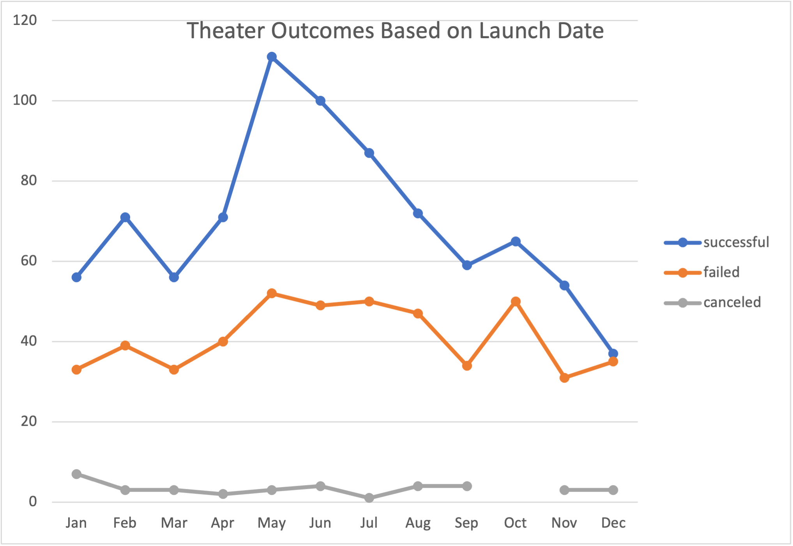
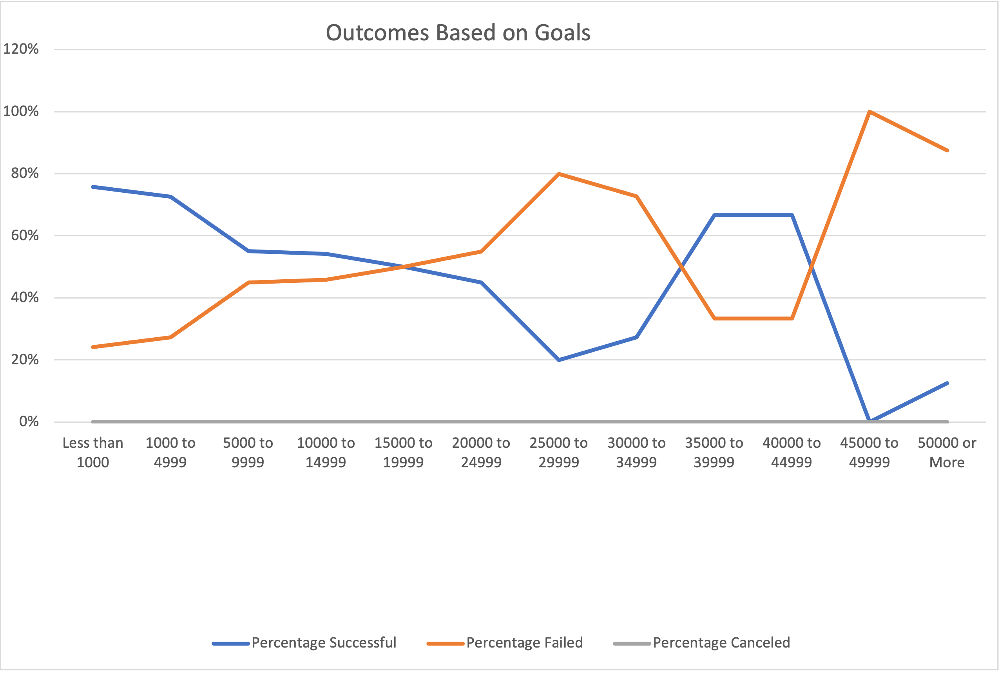

# Kickstarter-analysis

Performing analysis on Kickstarter data to uncover trends

## Overview of Project

In this project we are helping an "up-and-coming" playwright, Louise, who wants to start a crowdfunding campaign to fund her play, **Fever**. So to help her, we used Excel to organize, sort and performed data analysis on several thousand crowdfunding projects to uncover any hidden trends and find out whether there are specific factors that make a projects's campaign successful. We provided these insights to help Louise plan her own campaign and set it up for success.

## Analysis and Challenges

### Analysis of Outcomes Based on Launch Date

The focus of this analysis was on the Theater campaign based on the launch date. To achieve this, we made a pivot table by customising fields to include **filter** in two categories. 1) Parent Category 2) Years , **rows** with Date created Conversion(months), **columns** and **values** with Outcomes. Using filters, we can update our charts to view data for only theater in Parent Category.
To take our analysis a step further and customize the data to provide visual feedback, Line chart is created as they are helpful when trying to determine trends. We can see by looking at our new chart that the months of May and June both have a greater success rate.

 

### Analysis of Outcomes Based on Goals

The focus of this analysis is to analyze the percentage of successful, failed and canceled plays based on the funding goal amount. So, we created a table on a new sheet, within the Kickstarter MS Excel workbook. The table aims to capture the outcomes based on campaign funding goals, broken down in to 12 groupings, ranging from less than $1,000 up to more than $50,000. The COUNTIFS function was used to capture the outcome and goal data for the “plays” subcategory, to get the number of successful, failed and canceled campaigns. After calculating the percentage of successful, failed and canceled projects, a line chart was created to visualize the data. We can see that the higher the goal, the less likely it would succeed. On the other hand, plays which had a goal between $35000 and $44999 also had a good success rate close to 67%. This can indicate that other than just the fundraising goal there could be other factors that play an important role in deciding a successful campaign.

 

### Challenges and Difficulties Encountered

Few of the challenges i came across are:

1. Converting the Unix timestamps to a more readable format. I had to use the **Date** format function to get the correct format for the date.

2. Initially while creating pivot table for outcomes based on launch date, i could not get months in rows to display data.

3. Adding statistical components to deepen our analysis was difficult initially.

## Results

- What are two conclusions you can draw about the Outcomes based on Launch Date?

1. The best time to launch campaign would be May/June.
2. Campaigns are least succesful in winter season i.e. Nov/Dec.

- What can you conclude about the Outcomes based on Goals?

1. Campaigns with an average goal of $5000 or less were successful whereas campaigns with average goals of greater than $10000 had a higher failure rate.
2. There can also be other factors that influence success rate as plays which had a goal between $35000 and $44999 also had a good success rate.

- What are some limitations of this dataset?

1. Data on the demographics of the people who pledged in the fundraiser could help us to know how to cater campaigns to target goals based on specific ages groups and interests.
2. More datasets on Theatre Category.

- What are some other possible tables and/or graphs that we could create?

1. To better understand the correlation of the Fundraising Goals and launch date with successful campaigns we can calculate central tendency measures such as mean, mode and median and also the spread of the data through variance and standard deviation. We can also find out the outliers.
